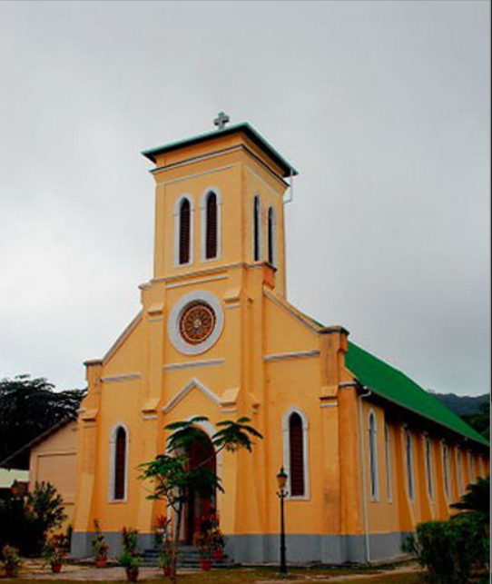
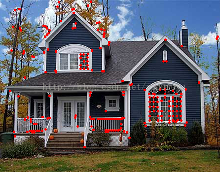

# FeatureDetector

策略模式是指将每一个算法封装到具有共同接口的独立的类中，从而使得它们可以相互替换。策略模式使得算法可以在不影响到客户端的情况下发生变化。该模式的设计原则是找出应用可能需要变化之处，把它们独立出来，不要和那些不需要变化的代码混在一起，即多用组合，少用继承。

在``FeatureDetector``类中，定义了公共的``detect``方法来进行特征检测：(还有一个针对多张图像的重载函数，其通过调用这个针对单张图像的``detect``函数实现，不再列出)
```
CV_WRAP void detect( const Mat& image, CV_OUT vector<KeyPoint>& keypoints, const Mat& mask=Mat() ) const;
```
观察其具体实现，可以发现，其通过调用``detectImpl()``实现，而``detectImpl()``在``FeatureDetector``类中是一个虚函数：
```
virtual void detectImpl( const Mat& image, vector<KeyPoint>& keypoints, const Mat& mask=Mat() ) const = 0;
```
在Opencv中，实现了多个不同的算法子类（如SIFT、MSER、GFTT等），继承了``FeatureDetector``类，并对``detectImpl()``方法重写而进行特征检测的具体实现。从而，不同算法间是可替换的。

在使用特征检测时，可以使用如下的方式进行：
```
Ptr<FeatureDetector> detector = FeatureDetector::create( "SIFT" );
...
detector->detect(img1, keypoints1);
```
可以看到，进行特征检测的``detector->detect()``是不依赖于具体算法的，实现了解耦。

* 备注：create部分并没有使用工厂模式，因为create方法直接new了子类对象，而没有将对象的实例化延迟到子类进行。（？）


## MSER(Maximal Stable Extremal Regions)

MSER 算法是opencv中用于提取特征区域的方法，计算图像 MSER 的基础类是 cv::MSER，它继承自 FeatureDetector 类，cv::MSER 类的实例可以通过create 方法创建。我们在初始化时指定被检测区域的最小和最大尺寸，以便限制被检测特征的数量，调用方式如下：

    cv::Ptr<cv::MSER> ptrMSER=
    cv::MSER::create(5, // 局部检测时使用的增量值
                    200, // 允许的最小面积
                    20000); // 允许的最大面积

我们可以通过调用 detectRegions 方法来获得 MSER，指定输入图像和一个相关的输出数据结构，代码如下所示：

    // 点集的容器
    std::vector<std::vector<cv::Point> > points;
    // 矩形的容器
    std::vector<cv::Rect> rects;
    // 检测 MSER 特征
    ptrMSER->detectRegions(image, points, rects);
代码具体实现如下：

    class CV_EXPORTS_W MSER : public FeatureDetector
    {
    public:
        //! the full constructor
        CV_WRAP explicit MSER( int _delta=5, int _min_area=60, int _max_area=14400,
            double _max_variation=0.25, double _min_diversity=.2,
            int _max_evolution=200, double _area_threshold=1.01,
            double _min_margin=0.003, int _edge_blur_size=5 );
    
        //! the operator that extracts the MSERs from the image or the specific part of it
        CV_WRAP_AS(detect) void operator()( const Mat& image, CV_OUT vector<vector<Point> >& msers,const Mat& mask=Mat() ) const;
        AlgorithmInfo* info() const;
    
    protected:
        void detectImpl( const Mat& image, vector<KeyPoint>& keypoints, const Mat& mask=Mat() ) const;
    
        int delta;
        int minArea;
        int maxArea;
        double maxVariation;
        double minDiversity;
        int maxEvolution;
        double areaThreshold;
        double minMargin;
        int edgeBlurSize;
    };
其中，

* ***detectImpl()*** 是一个虚拟方法，用于执行MSER算法，将检测到的MSER区域的轮廓转化为关键点（KeyPoint），并将这些关键点存储在 keypoints 向量中，以便进一步的处理或分析。这是从FeatureDetector继承的方法，同时与其它类一样，定义了一个相同的接口，是策略模式的具体体现。
* ***CV_WRAP explicit MSER*** 是 MSER 类的构造函数，用于初始化 MSER 对象的属性。这些参数包括 _delta、_min_area、_max_area 等，它们分别表示MSER算法的各种参数，例如区域的最小面积、最大面积、最大变化率等。
* ***CV_WRAP_AS(detect) void operator()*** 是一个函数调用运算符（operator()）的重载，它允许类的对象像函数一样被调用。这个方法用于从输入图像 image 中提取MSER，并将结果存储在 msers 参数中。该方法还接受一个可选的掩码 mask。

**实现效果如图所示：**




## GFTT(GoodFeaturesToTrackDetector)

在角点检测的算法中，一个是***cornerHarris***计算角点，但是这种角点检测算法容易出现聚簇现象以及角点信息有丢失和位置偏移现象，所以后面又提出一种名为***goodFeatureToTrack***的角点检测算法，它不仅支持**Harris**角点检测，也支持**Shi Tomasi**算法的角点检测。opencv的**FeatureDetector**接口集成了这种算法,名称为**GFTTDetector**

**代码如下：**

    class CV_EXPORTS_W GFTTDetector : public FeatureDetector
    {
    public:
        CV_WRAP GFTTDetector( int maxCorners=1000, double qualityLevel=0.01, double minDistance=1,
                            int blockSize=3, bool useHarrisDetector=false, double k=0.04 );
        AlgorithmInfo* info() const;
    
    protected:
        virtual void detectImpl( const Mat& image, vector<KeyPoint>& keypoints, const Mat& mask=Mat() ) const;
    
        int nfeatures;
        double qualityLevel;
        double minDistance;
        int blockSize;
        bool useHarrisDetector;
        double k;
    };
其中，
* **CV_WRAP GFTTDetector** 中**maxCorners**用于限定检测到的点数的最大值；**qualityLevel**表示检测到的角点的质量水平（通常是0.10到0.01之间的数值，不能大于1.0）；**minDistance**用于区分相邻两个角点的最小距离（小于这个距离得点将进行合并）；**blockSize**表示在计算角点时参与运算的区域大小，常用值为3，但是如果图像的分辨率较高则可以考虑使用较大一点的值；**useHarrisDetector**用于指定角点检测的方法，如果是true则使用Harris角点检测，false则使用Shi Tomasi算法；k是在使用Harris算法时使用，最好使用默认值0.04。
* ***detectImpl()*** 是一个虚拟方法，用于执行GFTT角点检测算法，将检测到的角点转化为关键点（KeyPoint），并将这些关键点存储在 keypoints 向量中。这是从FeatureDetector继承的方法，同时与其它类一样，定义了一个相同的接口，是策略模式的具体体现。

**实现效果如图所示：**



## DenseFeatureDetector
DenseFeatureDetector可以生成在图像上密集且规律分布的图像特征点，多用于3D VIZ。

DenseFeatureDetector把输入图像分割成大小相等的网格，每一个网格提取一个像素作为特征点。DenseFeatureDetector可以生成多个级别（数量由``featureScaleLevels``指定）的图像的特征点，每一级别所分割的网格大小是不同的，即各级别的尺度不同。

```
class CV_EXPORTS DenseFeatureDetector : public FeatureDetector
{
public:
    explicit DenseFeatureDetector( float initFeatureScale=1.f, int featureScaleLevels=1,
                                   float featureScaleMul=0.1f,
                                   int initXyStep=6, int initImgBound=0,
                                   bool varyXyStepWithScale=true,
                                   bool varyImgBoundWithScale=false );
    AlgorithmInfo* info() const;

protected:
    virtual void detectImpl( const Mat& image, vector<KeyPoint>& keypoints, const Mat& mask=Mat() ) const;

    double initFeatureScale;
    int featureScaleLevels;
    double featureScaleMul;

    int initXyStep;
    int initImgBound;

    bool varyXyStepWithScale;
    bool varyImgBoundWithScale;
};
```
其中，

* ``detectImpl()`` 是一个``virtual``的方法，继承自``FetureDetector``基类，是Dense的特征检测算法的具体实现。它通过在图像上均匀采样不同尺度的特征点，并根据设置的参数调整尺度和步长。生成的特征点存储在 keypoints 向量中。
* ``DenseFeatureDetector``是一个具体策略类，它的``detectImpl()``方法是特征检测算法的一个具体实现。